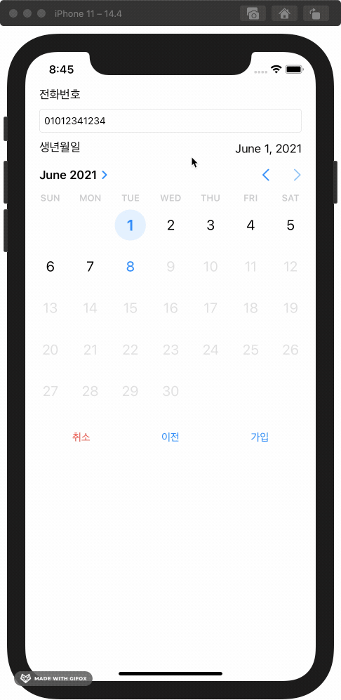

# 회원가입 화면
<!-- 뱃지 라인 -->

| 📺 데모 | 💡 개요 |
| ------- | ------- |
|  | 🚀 회원가입하는 절차와 화면 구현   🧑🏻‍💻 팀 프로젝트: `Jacob`, [`Glenn`](https://github.com/iluxsm)   🗓 진행 기간: 2020.11.30 ~ 12.06 (1주)   ⚙️ 기능   &nbsp;&nbsp;&nbsp;&nbsp; `기타 영역 터치 시 키보드 내리기`   &nbsp;&nbsp;&nbsp;&nbsp; `다음 텍스트필드로 커서 이동`   &nbsp;&nbsp;&nbsp;&nbsp; `사진첩에서 프사 가져오기`   &nbsp;&nbsp;&nbsp;&nbsp; `개인 정보 입력 확인`   &nbsp;&nbsp;&nbsp;&nbsp; `전화번호 확인`   &nbsp;&nbsp;&nbsp;&nbsp; `개인 정보 임시 저장`   📝 학습 키워드   &nbsp;&nbsp;&nbsp;&nbsp; `Navigation Controller`   &nbsp;&nbsp;&nbsp;&nbsp; `Text Field`   &nbsp;&nbsp;&nbsp;&nbsp; `Text View`   &nbsp;&nbsp;&nbsp;&nbsp; `Image Picker`   &nbsp;&nbsp;&nbsp;&nbsp; `Date Picker`   &nbsp;&nbsp;&nbsp;&nbsp; `Gesture Recognizer`   &nbsp;&nbsp;&nbsp;&nbsp; `Singleton` |

   

## 목차

1. [프로젝트](#프로젝트)
    - [팀원과 역할 분배](#팀원과-역할-분배)
    - [Git & GitHub으로 협업하기](#Git--GitHub으로-협업하기)
    - [팀 그라운드 룰](#팀-그라운드-룰)
    - [TWL](#This-week-We-Learned)
2. [기능](#기능)
3. [학습 내용](#1-학습-내용)
4. [배운 내용](#2-배운-내용)
5. [고민한 내용](#3-고민한-내용)
6. [개선하고 싶은 내용](#4-개선하고-싶은-내용)

   

## 프로젝트

- 회원가입하는 절차와 화면 구현
- 진행 기간: 2020.11.30~12.06 (1주)

### 팀원과 역할 분배

- `Jacob`, [`Glenn`](https://github.com/iluxsm)
- **역할을 나누지 않고 각자의 방법대로 구현한 후, 리뷰를 통해 더 나은 코드로 통합하기**  
    프로젝트 진행 방식에 대해 논의한 결과, 빠른 기능 구현보다는 iOS의 많은 것을 직접 구현해보고 서로 비교하여 더 나은 방식으로 통합하는 것이 좋다고 판단했다.

### Git & GitHub으로 협업하기

Git과 GitHub으로 협업하기 위환 최소한의 규칙을 정하고 지키기 위해 노력하기로 했다.  
- 각자 구현하기로한 부분이 완료되면 PR을 통해 리뷰하고 머지하기
- 팀 그라운드 룰로 정한 규칙 위주로 점검하고 의견 말하기

[👆목차로 가기](#목차)
   

### 팀 그라운드 룰

- 우리 팀만의 규칙
    - 공부시간: 오전 11시 ~ 오후 9시
    - 교육시간 외에는 회의실에서 같이 진행
    - 연락은 아무때나 해도 된다
    - 오랜시간 자리를 비우게 될 때는 얘기해준다
- 스크럼 주제
    - 오전 11시에 스크럼 하기
    - 어제 하기로 한 것 중에 못한 것 이야기
    - 오늘 할 일 위주로 이야기하기

#### 프로젝트 규칙

- 브랜치 이름
    - 스텝별로 공동 브랜치 생성 "step-1", 개인 브랜치 "step-1-닉네임-기능". 
    - ex) step-1-jacob-feature
- 커밋 단위
    - func 하나 단위로는 꼭 커밋 해주기(최대한 자주)
    - 실행 가능한 상태에서 커밋 하기
- 코딩 컨벤션
    - Swift API 디자인 가이드라인을 따르려고 노력한다
    - 클래스, 함수, 변수 명을 명확하고 객관적인 이름으로 하기
    - 주석 필요한 경우 간단 명료하게
- PR
    - 각자 기능이 완성되면 step별 브랜치로 PR 보내고 코드리뷰 후 머지한다. 
    - step별 브랜치 완료되면 야곰 저장소로 PR한다.

#### 커밋 메시지 규칙

- 한글로 작성하기 (단, 제목의 Type은 영문으로 작성)
- 제목작성 Type : 제목
    - Feat : 코드, 새로운 기능 추가
    - Fix : 버그 수정
    - Docs : 문서 수정
    - Style : 코드 스타일 변경 (기능, 로직 변경 x)
    - Test : 테스트 관련
    - Refactor : 코드 리팩토링
- title은 간단하게 description은 자세히! 
    - 간단한 경우에는 description 없어도 됨

[👆목차로 가기](#목차)
   

### This week We Learned

팀 주간 회고
- 2020.12.05 금요일 작성

#### 타임 라인

| 요일 | 내용 | 
| :--: | :--- |
| 월   | UML 강의 (리뷰어 흰), 팀 그라운드 룰 정하기 |
| 화   | Step 1 진행 및 PR |
| 수   | SOLID 강의 (리뷰어 붱이), Step 2 진행 및 PR |
| 목   | Step 3 진행 및 PR |
| 금   | Step 4 진행 및 PR |

#### 잘한 점 

- 매일 스크럼 시간에 함께 정한 목표를 지키기위해 노력했고, 모두 지킬 수 있었다.
- 서로의 의견을 잘얘기하고 들을려고 노력했다.
- GitHub로 협업하려고 노력했다.

#### 개선할 점 

- 11부터 9시까지의 학습시간을 지키지 못하는 경우가 있었다.
- 강의에 참여하기전에 예습을 많이하지 않았다. 예습을 제대로 하고 참여하면 더 얻어갈게 많았을 것 같다.

#### 학습 키워드

- UML
- SOLID 원칙
- UIImagePicker 사용
- UIDatePicker 사용
- Singleton 구현
- AppDelegate, SceneDelegate

#### 칭찬하기

- Jacob이 Glenn에게: 글렌은 제가 놓치거나 생각하지 못했던 것들을 잘 발견해 주어서 실수를 많이 방지할 수 있었습니다. 또, 제가 해보고 싶은 방식을 지지해 주면서 더 나은 방법도 잘 제시해 주어 프로젝트를 수월하게 진행할 수 있었습니다. 감사합니다.

- Glenn이 Jacob에게: 팀원을 배려해 주는 모습과 항상 차분하고 침착하게 문제를 해결해 나가는 모습을 보고 많은 걸 느꼈어요. 그리고 코드를 작성할 때 생각이 미치지 못하는 부분을 세세하게 체크해 줬고, 스스로에게 왜 이걸 이렇게 썼을까라는 질문을 자주 하게 만들어 줬어요. 감사합니다.

[👆목차로 가기](#목차)
   

## 기능

<!-- | 기타 영역 터치시 키보드 내리기 | 입력 커서 이동 | 사진첩에서 프사 가져오기 | 개인 정보 입력 확인 |
| :-: | :-: | :-: | :-: | 
|  |  |  |  |
| **전화번호 확인** | **개인 정보 입시 저장** |
|  |  | -->

| 기능 | 설명 |
| ---- | ---- |
|    [👆목차로 가기](#목차) | **기타 영역 터치시 키보드 내리기**   1. `Text Field`를 터치하면 문자 입력을 위한 키보드가 올라온다   2. `Text Field`외에 기타 영역을 터치하면 키보드가 내려간다 |
|    [👆목차로 가기](#목차) | **다음 텍스트필드로 커서 이동**   1. `Text Field`에 정보 입력 2. `Next`key를 누르면 다음 `Text Field`로 커서가 이동하여 입력을 계속할 수 있다  |

## 학습 내용

## 배운 내용

## 고민한 내용

## 개선하고 싶은 내용

[👆목차로 가기](#목차)
   