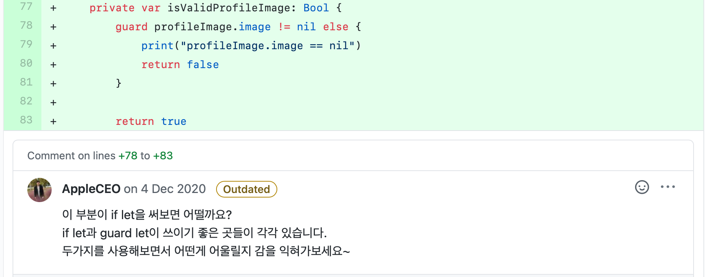

# 회원가입 화면
<!-- 뱃지 라인 -->

| 📺 데모 | 💡 개요 |
| ------- | ------- |
|  | 🚀 회원가입하는 절차와 화면 구현   🧑🏻‍💻 팀 프로젝트: `Jacob`, [`Glenn`](https://github.com/iluxsm)   🗓 진행 기간: 2020.11.30 ~ 12.06 (1주)   ⚙️ 기능   &nbsp;&nbsp;&nbsp;&nbsp; `기타 영역 터치 시 키보드 내리기`   &nbsp;&nbsp;&nbsp;&nbsp; `다음 텍스트필드로 커서 이동`   &nbsp;&nbsp;&nbsp;&nbsp; `사진첩에서 프사 가져오기`   &nbsp;&nbsp;&nbsp;&nbsp; `개인 정보 입력 확인`   &nbsp;&nbsp;&nbsp;&nbsp; `전화번호 확인`   &nbsp;&nbsp;&nbsp;&nbsp; `개인 정보 임시 저장`   📝 학습 키워드   &nbsp;&nbsp;&nbsp;&nbsp; `Navigation Controller`   &nbsp;&nbsp;&nbsp;&nbsp; `Text Field`   &nbsp;&nbsp;&nbsp;&nbsp; `Text View`   &nbsp;&nbsp;&nbsp;&nbsp; `Image Picker`   &nbsp;&nbsp;&nbsp;&nbsp; `Date Picker`   &nbsp;&nbsp;&nbsp;&nbsp; `Gesture Recognizer`   &nbsp;&nbsp;&nbsp;&nbsp; `Singleton` |

   

## 목차

1. [프로젝트](#프로젝트)
    - [기능](#기능)
    - [팀원과 역할 분배](#팀원과-역할-분배)
    - [Git & GitHub으로 협업하기](#Git--GitHub으로-협업하기)
    - [팀 그라운드 룰](#팀-그라운드-룰)
    - [TWL](#This-week-We-Learned)
2. [학습 내용](#학습-내용)
    - [싱글턴 패턴으로 데이터 공유](#싱글턴-패턴으로-데이터-공유)
    - [Image View 터치 시 Image Picker 띄우기](#Image-View-터치-시-Image-Picker-띄우기)
    - [Image Picker Controller로 사진첩에서 사진 가져오기](#Image-Picker-Controller로-사진첩에서-사진-가져오기)
    - [Date Picker로 날짜 정보 가져오기](#Date-Picker로-날짜-정보-가져오기)
    - [Segue로 모달 화면 띄우기](#Segue로-모달-화면-띄우기)
    - [Navigaion Controller 추가하기](#Navigaion-Controller-추가하기)
3. [배운 내용](#배운-내용)
    - [if vs guard](#if-vs-guard)
    - 코드의 공백이나 개행에도 의미가 있어야 한다
4. [고민한 내용](#고민한-내용)
    - 모달 vs 내비게이션
    - 키보드 내리는 방법 선택
    - 싱글턴의 인스턴스 이름
5. 트러블 슈팅
    - 텍스트필드 권장 암호?!

   

## 프로젝트

- 회원가입하는 절차와 화면 구현
- 진행 기간: 2020.11.30~12.06 (1주)

### 기능

| 📺 데모 |  🗓 기능 |
| ------- | -------- |
|  | **기타 영역 터치시 키보드 내리기**    1. `Text Field`를 터치하면 문자 입력을 위한 키보드가 올라온다   2. `Text Field`외에 기타 영역을 터치하면 키보드가 내려간다 |
|  | **다음 텍스트필드로 커서 이동**    1. `Text Field`에 정보 입력   2. `Next`키를 누르면 다음 `Text Field`로 커서가 이동하여 입력을 계속할 수 있다 |
|  | **사진첩에서 프로필 사진 가져오기**    1. 프로필 사진 `Image View`를 터치하면 `Image Picker Controller`를 띄운다   2. 프로필 사진으로 가져올 사진을 선택한다   3. 사진의 크기 및 위치를 조절한다   4. `Choose`를 누르면 편집된 프로필 사진이 `Image View`에 보인다 |
|  | **개인 정보 입력 확인**    1. `다음 버튼`은 기본적으로 비활성화   2. 회원가입을 위한 모든 정보가 입력됐고, 비밀번호가 동일하면 `다음 버튼` 활성화 |
|  | **전화번호 확인**    1. 입력한 전화번호가 규칙에 맞는지 확인   2. 일치하면 키보드 내리기   3. 일치하지 않으면 에러 표시하여 수정하도록 유도 | 
|  | **개인 정보 임시 저장**    이전 화면으로 돌아가도 현재 화면의 정보가 지워지지 않고 임시로 유지됨 |

[👆목차로 가기](#목차)
   

### 팀원과 역할 분배

- `Jacob`, [`Glenn`](https://github.com/iluxsm)
- **역할을 나누지 않고 각자의 방법대로 구현한 후, 리뷰를 통해 더 나은 코드로 통합하기**  
    프로젝트 진행 방식에 대해 논의한 결과, 빠른 기능 구현보다는 iOS의 많은 것을 직접 구현해보고 서로 비교하여 더 나은 방식으로 통합하는 것이 좋다고 판단했다.

### Git & GitHub으로 협업하기

Git과 GitHub으로 협업하기 위환 최소한의 규칙을 정하고 지키기 위해 노력하기로 했다.  
- 각자 구현하기로한 부분이 완료되면 PR을 통해 리뷰하고 머지하기
- 팀 그라운드 룰로 정한 규칙 위주로 점검하고 의견 말하기

[👆목차로 가기](#목차)
   

### 팀 그라운드 룰

- 우리 팀만의 규칙
    - 공부시간: 오전 11시 ~ 오후 9시
    - 교육시간 외에는 회의실에서 같이 진행
    - 연락은 아무때나 해도 된다
    - 오랜시간 자리를 비우게 될 때는 얘기해준다
- 스크럼 주제
    - 오전 11시에 스크럼 하기
    - 어제 하기로 한 것 중에 못한 것 이야기
    - 오늘 할 일 위주로 이야기하기

#### 프로젝트 규칙

- 브랜치 이름
    - 스텝별로 공동 브랜치 생성 "step-1", 개인 브랜치 "step-1-닉네임-기능". 
    - ex) step-1-jacob-feature
- 커밋 단위
    - func 하나 단위로는 꼭 커밋 해주기(최대한 자주)
    - 실행 가능한 상태에서 커밋 하기
- 코딩 컨벤션
    - Swift API 디자인 가이드라인을 따르려고 노력한다
    - 클래스, 함수, 변수 명을 명확하고 객관적인 이름으로 하기
    - 주석 필요한 경우 간단 명료하게
- PR
    - 각자 기능이 완성되면 step별 브랜치로 PR 보내고 코드리뷰 후 머지한다. 
    - step별 브랜치 완료되면 야곰 저장소로 PR한다.

#### 커밋 메시지 규칙

- 한글로 작성하기 (단, 제목의 Type은 영문으로 작성)
- 제목작성 Type : 제목
    - Feat : 코드, 새로운 기능 추가
    - Fix : 버그 수정
    - Docs : 문서 수정
    - Style : 코드 스타일 변경 (기능, 로직 변경 x)
    - Test : 테스트 관련
    - Refactor : 코드 리팩토링
- title은 간단하게 description은 자세히! 
    - 간단한 경우에는 description 없어도 됨

[👆목차로 가기](#목차)
   

### This week We Learned

팀 주간 회고
- 2020.12.05 금요일 작성

#### 타임 라인

| 요일 | 내용 | 
| :--: | :--- |
| 월   | UML 강의 (리뷰어 흰), 팀 그라운드 룰 정하기 |
| 화   | Step 1 진행 및 PR |
| 수   | SOLID 강의 (리뷰어 붱이), Step 2 진행 및 PR |
| 목   | Step 3 진행 및 PR |
| 금   | Step 4 진행 및 PR |

#### 잘한 점 

- 매일 스크럼 시간에 함께 정한 목표를 지키기 위해 노력했고, 모두 지킬 수 있었다.
- 서로의 의견을 잘 얘기하고 들으려고 노력했다.
- GitHub로 협업하려고 노력했다.

#### 개선할 점 

- 11부터 9시까지의 학습시간을 지키지 못하는 경우가 있었다.
- 강의에 참여하기 전에 예습을 많이 하지 않았다. 예습을 제대로 하고 참여하면 더 얻어 갈게 많았을 것 같다.

#### 학습 키워드

- UML
- SOLID 원칙
- UIImagePicker 사용
- UIDatePicker 사용
- Singleton 구현
- AppDelegate, SceneDelegate

#### 칭찬하기

- Jacob이 Glenn에게: 글렌은 제가 놓치거나 생각하지 못했던 것들을 잘 발견해 주어서 실수를 많이 방지할 수 있었습니다. 또, 제가 해보고 싶은 방식을 지지해 주면서 더 나은 방법도 잘 제시해 주어 프로젝트를 수월하게 진행할 수 있었습니다. 감사합니다.

- Glenn이 Jacob에게: 팀원을 배려해 주는 모습과 항상 차분하고 침착하게 문제를 해결해 나가는 모습을 보고 많은 걸 느꼈어요. 그리고 코드를 작성할 때 생각이 미치지 못하는 부분을 세세하게 체크해 줬고, 스스로에게 왜 이걸 이렇게 썼을까라는 질문을 자주 하게 만들어 줬어요. 감사합니다.

[👆목차로 가기](#목차)
   

## 학습 내용

### 싱글턴 패턴으로 데이터 공유

회원가입 절차가 여러 화면으로 이루어져 있어서 화면 전환 시에도 이미 입력한 사용자 정보를 저장할 타입이 필요했다.  
이를 위해 사용자 정보 저장 용도의 객체를 싱글턴 패턴으로 만들어서 하나의 인스턴스를 공용으로 사용하게 구현했다.

#### 싱글턴 패턴 구현

~~~swift
class UserInformation {
    static let card = UserInformation()

    var id: String?
    var password: String?
    ...

    private init() {}
}
~~~

싱글턴 패턴은 하나의 인스턴스를 보장해야하므로 인스턴스를 생성할수 없도록 생성자에 private 접근제한을 건다.  
  
싱글터 인스턴스는 `UserInformation.card`로 접근할 수 있으며, static 이므로 최초 접근 시에 인스턴스가 생성되며 이후에는 생성된 인스턴스를 제공한다.

[👆목차로 가기](#목차)
   

### Image View 터치 시 Image Picker 띄우기

프로필 사진 이미지 뷰를 터치하면 이미지 피커를 띄워서 사진을 선택하는 기능을 구현하려 한다.  
이미지 뷰는 버튼과 다르게 터치 액션을 만들 수 없다.  
  
이미지 뷰의 터치를 인식해서 특정 메서드가 실행되도록 `UITapGestureRecognizer`를 사용해서 구현했다.

#### 프로필 이미지 뷰에 탭 제스처 등록하기

탭 제스처가 인식되면 `showImagePicker()`가 호출되는 `UITapGestureRecognizer`를 Target-Action 패턴으로 생성하고 프로필 이미지 뷰의 Gesture Recognizer에 추가한다.

~~~swift
let tapGesture = UITapGestureRecognizer(target: self, action: #selector(showImagePicker))
profileImage.addGestureRecognizer(tapGesture)
profileImage.isUserInteractionEnabled = true
~~~

#### 이미지 피커 컨트롤러 띄우기

위에서 탭 제스처 인식기에 등록한 메서드를 구현한다.  
Target-Action 패턴으로 액션 메서드를 등록하려면 메서드에 `@objc` 를 붙여야 한다.  
  
이제 이미지 뷰를 터치하면 이 메서드가 호출되어 이미지 피커 컨트롤러를 present 한다.

~~~swift
@objc private func showImagePicker() {
    imagePickerController.sourceType = UIImagePickerController.SourceType.savedPhotosAlbum
    imagePickerController.allowsEditing = true
    
    self.present(imagePickerController, animated: true, completion: nil)
}
~~~

[👆목차로 가기](#목차)
   

### Image Picker Controller로 사진첩에서 사진 가져오기

이미지 피커에서 이미지를 선택하면, 이미지를 가져오고 이미지 피커 화면을 내리기 위해 `UIImagePickerControllerDelegate`의 `imagePickerController(_:didFinishPickingMediaWithInfo:)` 메서드를 사용한다.  
이 메서드는 이미지 피커에서 이미지 선택이 완료되면 호출되는 델리게이트 메서드다.  
  
선택한 이미지 원본이 아닌 편집된 사진을 가져오기위해 `info[UIImagePickerController.InfoKey.editedImage]`로 접근한다.  
사진을 이미지 뷰로 가져왔으면 `dismiss`로 이미지 피커 컨트롤러 화면을 내린다.

~~~swift
func imagePickerController(_ picker: UIImagePickerController, didFinishPickingMediaWithInfo info: [UIImagePickerController.InfoKey : Any]) {
    if let selectedImage = info[UIImagePickerController.InfoKey.editedImage] as? UIImage {
        profileImage.image = selectedImage
    }
    
    dismiss(animated: true, completion: nil)
}
~~~

[👆목차로 가기](#목차)
   

### Date Picker로 날짜 정보 가져오기

Date Picker로 날짜를 선택할 때 마다 바로 날짜 정보를 가져와서 반영하기 위해 
Target-Action 패턴으로 Date Picker의 값이 변경될 때 마다 `didDatePickerValueChanged()`가 호출되도록 등록한다.  
  
~~~swift
func setupDatePicker() {
    birthDatePicker.addTarget(self, action: #selector(didDatePickerValueChanged(_:)), for: UIControl.Event.valueChanged)
    birthDatePicker.maximumDate = Date()
}
~~~

생년월일을 적는 곳이므로 오늘 날짜를 최댓값으로 등록한다.

~~~swift
@objc func didDatePickerValueChanged(_ sender: UIDatePicker) {
    updateDateLabelFromDatePicker(sender)
}
~~~

Date Picker로 선태한 Date 타입의 날짜정보를 dateFormatter를 이용해 String 타입으로 변환하여 Label에 표시해준다.

~~~swift
func updateDateLabelFromDatePicker(_ sender: UIDatePicker) {
    let dateString: String = dateFormatter.string(from: sender.date)
    birthDateLabel.text = dateString
}
~~~

[👆목차로 가기](#목차)
   

### Segue로 모달 화면 띄우기

`Sign Up` 버튼을 누르면 회원가입을 화면을 모달로 띄웠다.  
  
스토리보드의 `Sign Up`버튼을 누르고 `control`버튼을 누른채로 띄우려는 화면으로 드래그 앤 드랍하여 Action Segue 등록 창에서 Present Modally를 선택하면 연결된다.  
  
여기서는 내비게이션 컨트롤러 자체를 모달로 띄웠다.  

[👆목차로 가기](#목차)
   

### Navigaion Controller 추가하기

스토리보드에서 Navigaion Controller를 추가하려는 View Controller을 선택한 후 메뉴바의 Editor -> Embed In -> Navigation Controller을 선택하면 추가된다.

[👆목차로 가기](#목차)
   

## 배운 내용

### if vs guard

- 배경  
    Swift의 조건문에는 다른 언어와 다르게 `if`에 더해서 `guard`가 있고, if or guard를 선택하는 나의 기준이 있었다. 
    `guard`라는 명칭이 방어하고 미리 막는 느낌이 강해서, 로직상 잘못된 부분이나 미리 걸러야 하는 것을 처리할 때 guard를 주로 사용했다.
- [코드 리뷰 코멘트](https://github.com/yagom-academy/ios-signup-flow/pull/26/files/56489274eea82e0135abe4be2d276a6eb88f91cd#r535812747)  
    코드 리뷰에서 아래 코멘트를 받고 어떤 상황에서 if 또는 guard를 사용할지 다시 생각해 보았다.  
    
- 개선  
    수정한 코드 예시
    ~~~swift
    private var isValidProfileImage: Bool {
        if let _ = profileImage.image {
            return true
        } else {
            return false
        }
    }
    ~~~

    [피드백 코멘트](https://github.com/yagom-academy/ios-signup-flow/pull/26#issuecomment-738673080)  
    
- 배운 점  
    if or guard 선택할 때, 만약 회사나 팀에 규칙 있다면 그 기준을 지키면 될 것이다.
    하지만 규칙이 없다면 개인의 규칙을 만들어야 할 것이고,  
    초심자에게 그 기준은 코드가 좀 더 자연스럽게 읽힐 수 있는 방향으로 하는 것이 좋을 것 같다. 

    나는 로직상 잘못된 부분이나 미리 걸러야 하는 부분에 guard를 사용한다는 나름이 규칙을 정했지만,
    이것을 지키려다 보니 가독성을 해치는 경우를 발견할 수 있었다.
- 공식문서 확인 
    [Swift Language Guide - Control Flow](https://docs.swift.org/swift-book/LanguageGuide/ControlFlow.html) 문서의 `Early Exit` 토픽에서 guard 사용 관련 내용을 확인할 수 있다.
    > Using a guard statement for requirements improves the readability of your code, compared to doing the same check with an if statement. It lets you write the code that’s typically executed without wrapping it in an else block, and it lets you keep the code that handles a violated requirement next to the requirement.  
      
    조건문에 guard를 사용하면 일반적으로 실행되는 코드를 블록으로 감싸지 않고 사용할 수 있고, 조건을 위반하는 경우를 처리하는 코드를 조건문 옆에 둘 수 있으므로 가독성이 향상될 수 있다는 내용이다.  
      
    이번 경우와는 결이 살짝 다르게 느껴지지만, guard를 사용하는 것이 if 보다 가독성이 좋게 만드는 경우가 있다는 것을 배웠다.

[👆목차로 가기](#목차)
   

## 고민한 내용
